[comment]: # (IrRep: Symmetry eigenvalues and irreducible representations of *ab initio* band structures)


<figure>
	
</figure>

In the previous lecture, we have learnt that it is possible to diagnose topological bands if we are provided with their irreps at maximal K-points. But, how can we calculate these irreps? This is the main issue to be addressed in this section.

[comment]: # ( )


## The problem


Remember that **each representation** of a group **has its own character**, i.e. two non-equivalent representations have matrices with different traces. Then, given a set of (degenerate) states |&psi;<sub>n**k**</sub>>, we can determine the corresponding irreps by calculating the traces 

<div align="center">

&chi;={<&psi;<sub>n**k**</sub>|g|&psi;<sub>n**k**</sub>> | g &#1013; G<sub>**k**</sub>}

</div>

[comment]: # ()

and comparing them to the characters of irreps found in <a href="https://www.cryst.ehu.es/cgi-bin/cryst/programs/representations.pl?tipogrupo=dbg">tables</a>. This procedure requires determining first the action of symmetries on the states: g|&psi;<sub>n**k**</sub>>.

In practical scenarios, states on bands (what's the same, eigenstates of the Bloch Hamiltonian) are expanded in a basis. Indeed, we when we say that we have calculated these states, we mean that we have computed the coefficients of their expansion:

<div align="center">

|&psi;<sub>*n***k**</sub>> = &#8721;<sub>m</sub> C<sub>m</sub>|&phi;<sub>m</sub>>

</div>

[comment]: # ()

Usually, the way in which space group acts on the basis for the expansion is known from the beginning. Based on this knowledge, it is possible to derive how states on bands transform:

<div align="center">

g|&psi;<sub>*n***k**</sub>> = &#8721;<sub>m</sub> C<sub>m</sub>g|&phi;<sub>m</sub>>

</div>

[comment]: # ()

The **drawback** of the method resides in the **size of the basis**. In typical Density Functional Theory (DFT) codes, the basis for the expansion contains too many states to apply the method analytically. For instance, in `VASP`, `Abinit` and `Quantum Espresso` wave functions are expanded in terms of plane waves and it is not strange to find expansion involving 10<sup>3</sup>~10<sup>4</sup> plane waves. We thus need a way to tackle the problem in an automatic way.

`IrRep` is a Python code that determines the irreps of electronic Bloch states by computing the traces of symmetry operations and comparing them to character tables of irreps. Furthermore, it can also calculate the symmetry eigenvalues. These functionalities make `IrRep` an effective tool to study the connectivity of *ab initio* bands and, together with the formalism of <a href="https://www.nature.com/articles/nature23268"> Topological Quantum Chemistry </a>, it forms a powerful framework to diagnose and classify the topology of bands.

### `IrRep` is great because it works...

:white_check_mark: For all 230 space groups.

:white_check_mark: With and without SOC.

:white_check_mark:  For DFT calculations run with <a href="https://www.vasp.at"> VASP </a>,  <a href="https://www.abinit.org"> Abinit </a>, <a href="https://www.quantum-espresso.org"> Quantum Espresso </a> and codes with interfaces to <a href="http://www.wannier.org"> Wannier90 </a>.

:white_check_mark: With any choice of the unit cell.

:white_check_mark: Same notation as the <a href="https://www.cryst.ehu.es">Bilbao Crystallographic Server</a>.

:white_check_mark:  It's open source!
 

## Installation

There are **two ways** of installing it. Which of them suits you depends on your purpose. Both ways are straightforward.

### With Pip

This installation is suitable for users who just want to run `IrRep` and are not interested in the development of the code. Open a terminal and type:

```
pip install irrep
```

It's done! Fast, easy and for free!

You may notice that other packages, like <a href="https://numpy.org"> `Numpy`</a> and <a href="https://numpy.org"> `Scipy`</a>, have also being installed. They are packages required by `IrRep` (dependencies).

### Development mode

In case you are interested in taking part in the development of `IrRep` or in modifying it to satisfy your particular needs, you need to have easy access to the source code that is run every time you call to the program. You shall install `IrRep` in development mode, by following these steps:

1. Clone (download) the last version of the source code from `IrRep`'s official <a href="https://github.com/stepan-tsirkin/irrep">Github repository</a>:

```
git clone https://github.com/stepan-tsirkin/irrep.git
```

2- Enter the directory containing the `setup.py` file and run `pip` in *development mode*:

```
cd irrep
pip install -e .
```

## Example: SnTe


In this section, we will illustrate how to diagnose and classify with `IrRep` the topology of the valence bands of a particular material, SnTe. In particular, we will use `IrRep` to

1- Calculate the irreps of little groups at maximal k-points and derive the symmetry-indicators that identify the topology of valence bands (including the z<sub>2</sub> and z<sub>4</sub>-numbers).

2- Compute the inversion eigenvalues of valence bands to verify the z<sub>2</sub> and z<sub>4</sub>-indicators obtained in the previous step.

The first step is to calculate the wave functions with DFT. The output of the DFT calculation will be the input for `IrRep`. Which DFT code shall we use? Currently, `IrRep` has interfaces for <a href="https://www.vasp.at"> VASP </a>,  <a href="https://www.abinit.org"> Abinit </a>,  <a href="http://www.wannier.org"> Wannier90 </a> and <a href="https://www.quantum-espresso.org"> Quantum Espresso </a>, so any of these codes can be selected. We have chosen Quantum Espresso for this tutorial. 

<div align="center">
<figure>
	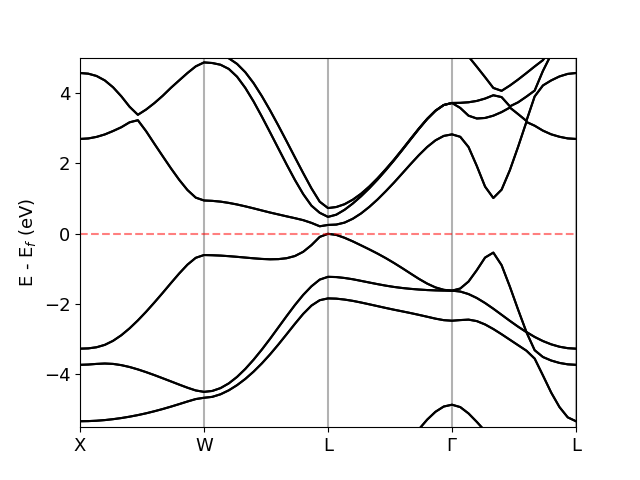
        <figcaption> <br>Fig.1: Bands of SnTe calculated with Quantum Espresso. </figcaption>
</figure>
</div>
<br/>

[comment]: # (Even if we would like to start the analysis by running the DFT calculation, we will just comment on the type of the required calculation and give its output. Nevertheless, inputs to run the DFT calculation can be found in the file `generate_input_espresso.sh` inside the directory `SnTe/DFT` and can be generated by running `bash generate_input_espresso.sh`.)


### Irreps at maximal k-points

First of all, activate the Python environment where `IrRep` was installed:

```
workon z2pack
```

Now, let's locate ourselves in the directory `SnTe/IrRep/irreps_maximal-K`:

```
cd SnTe/IrRep/irreps_maximal-K
```

Of course, we could run the calculation in any directory by choosing wisely the parameters of `IrRep`, but it's a good practice to keep the tutorial as simple as possible.

Once we are there, let us run `IrRep` with the following command (if you feel to lazy to type the command, you can copy it from the file `run_irrep.sh` or run it directly with `bash run_irrep.sh`):

```
irrep -code=espresso -prefix=../../DFT/out/snte -Ecut=50 -kpoints=1,16,31,46 -kpnames=X,W,L,GM -IBend=30 -EF=auto > IrRep.out
```

Let us slow a bit to comment on this command. As you may have noticed, some keywords start with a dash (`-`). They are input parameters that govern the way in which `IrRep` is run. The part after the `=` symbol is the value given to the parameter. Thus, the form of setting values to parameters in `IrRep` is `-parameter=value`.

Why have we set these parameters here? What does each of them specify?

- `-code=espresso`: it is telling to `IrRep` that the input data was obtained in a Quantum Espresso calculation. This way, `IrRep` gets to know which interface should be used to parse the data.

- `-prefix=../../DFT/out/snte`: it's the path to the `.save` directory where Quantum Espresso's output files are. It is related to the parameter <a href="https://www.quantum-espresso.org/Doc/INPUT_PW.html#idm92"> `outdir` </a> of Quantum Espresso. In our case, we see that this directory is `SnTe/DFT/out/snte.save`, but we are at `SnTe/IrRep/irrep_maximal-K`, thus we need to specify the (relative path) `../../DFT/out/snte.save`.

- `-Ecut=50`: The number of plane waves included in the expansion of Bloch states should have been infinite, but that would be numerically unrealistic. DFT codes "cut" the number of plane waves included in the basis based on a **cutoff** energy: only plane waves whose energy is smaller than the cutoff are included in the basis. The idea is similar in `IrRep`: only plane waves whose energy is smaller than the value of `Ecut` (always in eV) are included in the expansion of wave functions and coefficients corresponding to the rest of plane waves are not considered. 

:bulb: **Tip:** Usually, it is enough to set `Ecut` to around 50 or 100, which makes the run much faster. However, calculations of eigenvalues of symmetry operations may require larger values (still smaller than the DFT cutoff, most of the times).

- `-kpoints=1,16,31,46`: With this parameter, we pass to `IrRep` the indices of maximal k-points in the DFT calculation. In this example, the wave functions saved by Quantum Espresso belong to a calculation of the band structure along a path connecting the maximal k-points; we are specifying that the these special points are the 1<sup>st</sup>, 16<sup>th</sup>, 31<sup>st</sup> and 46<sup>th</sup>.

:bulb: **Tip:** It is a good practice to run first a self-consisten calculation of the electronic density, to later use that density to calculate the wave functions exclusively at maximal k-points and pass to `IrRep` only the data of the later calculation. That way, `IrRep` would run faster, as it wouldn't need to deal with data corresponding to non-maximal k-points (which is the case if we pass to it data of a band structure calculation along a path).

- `-kpnames=X,W,L,GM`: this parameter takes as value a comma-separated list of labels for the maximal k-points. The order of labels is consistent with the order of indices passed as `kpoints`. This labels can be found in the tables of irreps distributed together with the code or in the <a href="https://www.cryst.ehu.es/cryst/get_kvec.html"> Bilbao Crystallographic Server </a>.

-`IBend=30`: This parameter matches the band index of the last band included in the determination of irreps. We encourage setting this parameter equal to the number of valence bands if the ultimate objective is to calculate the invariants that classify the topology of the set of valence bands. 

-`EF=auto`: The parameter `EF` makes reference to the *Fermi energy* and it is used to choose the reference value of the energy used to write the energy-levels at the end of the calculation. If it is set to `auto`, `IrRep` will try to parse it from the DFT data files and set it to 0.0 eV in case it couldn't parse it; otherwise, if it's set to a number, that value will be used as reference energy-level.

:memo: **Note:** Only the most commonly used parameters have been introduced here, but `IrRep` has many other adjustable parameters. You can find them and their description by calling to `IrRep`'s help interface:

```
irrep --help
```

Now, let us inspect the output file `IrRep.out` created during the run. It contains the messages print by `IrRep` on the screen. It is convinient to capture it in a file that we can later open with a text editor without text wrapping. Let me split into parts this output:

- Description of the <ins> **unit cell**</ins>:
	- **(primitive) vectors**  that define the unit cell used for the DFT calculation.
	- Direct coordinates of **atomic positions**, i.e. in terms of basis vectors.
	- Indices describing the **types of atoms**. Each number corresponds to a different element.
	- **Reciprocal lattice vectors** that define the 1<sup>st</sup> BZ.
	- Matrix (`refUC`) and shift (`shiftUC`) that describe the **transformation** of the DFT unit cell **into the reference unit cell** for which the tables of irreps have been written. Concretely, if (**a**<sub>1</sub>, **a**<sub>2</sub>, **a**<sub>3</sub>) are the vectors of the DFT cell and  (**c**<sub>1</sub>, **c**<sub>2</sub>, **c**<sub>3</sub>) those of the reference cell, `refUC` is the matrix *M* that expresses the relation

        (**c**<sub>1</sub> **c**<sub>2</sub> **c**<sub>3</sub>)<sup>T</sup> = *M* (**a**<sub>1</sub> **a**<sub>2</sub> **a**<sub>3</sub>)<sup>T</sup>

        Similarly, if *O*<sub>p</sub> and *O*<sub>c</sub> are coordinates of the origin in the DFT calculation and the reference setting, respectively, then `shiftUC` gives the vector (s<sub>1</sub>  s<sub>2</sub>  s<sub>3</sub>) that relates both origins:

        O<sub>p</sub> = O<sub>c</sub> + (s<sub>1</sub>  s<sub>2</sub>  s<sub>3</sub>) . (**a**<sub>1</sub> **a**<sub>2</sub> **a**<sub>3</sub>)


	- Primitive vectors of the DFT and primitive unit cells.

- Description of the <ins>**space group**</ins>:
	- **Symbol** and **number** of the space group.
	- **Description of each symmetry operation** of the space group (mod. lattice translations). When DFT and reference unit cells don't match, the rotational, translational and spinor part of the symmetry will be printed in both settings.
        
- For each k-point, the **energy-levels**, their **degeneracy**, <ins>**irreps**</ins> and <ins>**traces**</ins> of symmetry operations are printed.

At this point, we have identified the irreps of bands at maximal k-points. We can place this information on top of a band structure plot.

<div align="center">
<figure>
	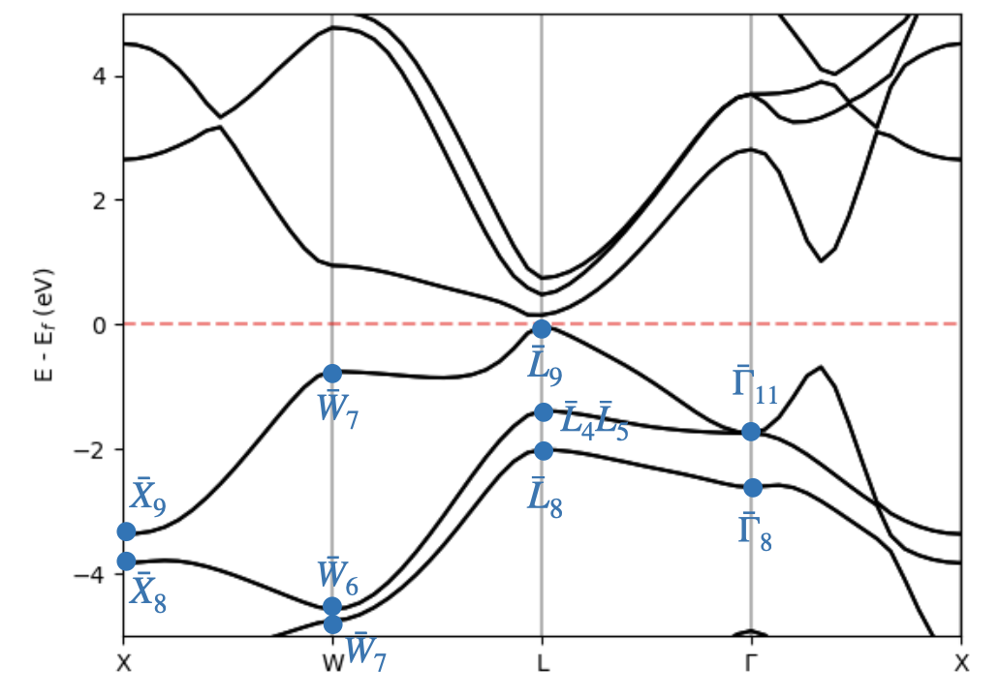
        <figcaption> Fig. 2: Bands of SnTe and irreps of valence bands calculated with IrRep </figcaption>
</figure>
</div>
<br/>

Once we have identified the irreps of valence bands, we can determine whether they are topological or not. For that, we have to check if this set of irreps matches with an atomic limit. We could take the tables of atomic limits of our space group and check it analytically, but it would be a nightmare because we have 30 states. Let's do it with the help of our computer.

You may have noticed that `IrRep` has also generated a file called `trace.txt`. It contains the same information as the output `IrRep.out` we have just inspected, but in a raw way, rather than in a user-friendly format. That's because it's not the user the one supposed to read the `trace.txt` file, but a computer. Concretely, this file is generated to be give to the software <a href="https://www.cryst.ehu.es/cgi-bin/cryst/programs/magnetictopo.pl?tipog=gesp"> Check Topological Mat. </a>. This program takes as input the traces of symmetry operations written by `IrRep` in the `trace.txt` file and checks if the corresponding bands could have an atomic limit. If they don't, it will calculate the values of the symmetry-indicators that diagnose the underlying topology. Let's try it!

<div align="center">
<figure>
	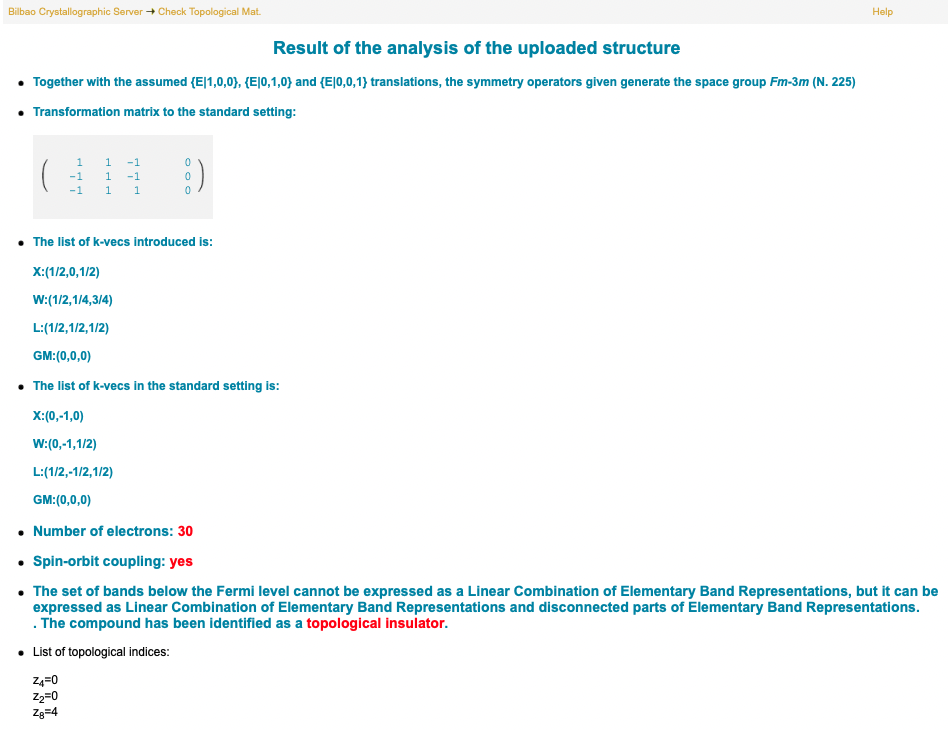
        <figcaption> Fig. 3: Output of ChecktopologicalMat with the file trace.txt generated by IrRep. </figcaption>
</figure>
</div>
<br/>


As we can see, the valence bands of SnTe are topological because they can't be induced from exponentially-localized Wannier functions in space group Fm-3m. Furthermore, the corresponding topological phase can be diagnosed by *z*<sub>2</sub>, *z*<sub>4</sub> and *z*<sub>8</sub> symmetry-indicators with values

<div align="center">

   (*z*<sub>2</sub>, *z*<sub>4</sub>, *z*<sub>8</sub>) = (0, 0, 4).

</div>

> <a href="https://www.nature.com/articles/s41467-018-06010-w"> Z. Song, T. Zhang, Z. Fang and C. Fang, *Nature Communications* 9, 3530 (2018) </a>

### Separating inversion subspaces

Sometimes, it might be convenient to separate the states belonging to different subspaces of a symmetry. For example, when studying potential crossings between bands or when calculating the value of an invariant or indicator based on eigenvalues of a particular symmetry. The later is the case here: let's check the previous calculation of the *z*<sub>2</sub> and *z*<sub>4</sub> indicators by applying Fu-Kane like formulae.

The weak and strong *z*<sub>2</sub> numbers can be computed by applying the Fu-Kane formulae: we have to calculate the number of inversion-odd Kramers pairs at all time-reversal invariant momenta in the BZ. If the product turns out to be -1 (+1), then </sup>*z*<sub>2</sub> = 1 (0). At this point, we could open the `IrRep.out` file calculated in the last run of `IrRep`, read the number of inversion-odd Kramers pairs and apply the formula. However, it could be helpful to separate the states in inversion subspaces. `IrRep` can make that for us.

Enter the `SnTe/IrRep/inversion_separate` directory and run the following command (you can find it in the file `run_irrep.sh`):

```
irrep -isymsep=25 -code=espresso -prefix=../../DFT/out/snte -Ecut=300 -kpoints=1,31,46 -kpnames=X,L,GM -IBend=30 -EF=auto > IrRep.out
```

The parameter `isymsep` is the index of the symmetry operation according to which we want to separate the states. In this case, we are asking `IrRep` to separate the states in subspaces of the 25<sup>th</sup> symmetry, i.e. inversion.

Now, we can read in the output `IrRep.out` the number of invesion-odd Kramers pairs at GM, X and L are 3, 3 and 7, respectively. Since the multiplicity of the points X (1/2, 0, 1/2) and L (1/2, 1/2, 1/2) in the BZ is 3 and 4 respectively, the product of all inversion-odd pairs is 3 + 3 x 3 + 4 x 7 = 40, thus *z*<sub>2</sub>=0.

<div align="center">

   |                 | &Gamma; |  X  |  L  |
   | :-------------: | ------- | --- | --- | 
   | *N*<sub>-</sub> |    3    |  3  |  7  | 
   | *N*<sub>+</sub> |    12   |  12 |  8  | 

</div>


The calculation of the *z*<sub>4</sub> number is similar. It's computed by applying the following formula:

<div align="center">

*z*<sub>4</sub> = (*N*<sub>-</sub> - *N*<sub>+</sub>) / 2,

</div>

where *N*<sub>+</sub> is the number of inversion-even Kramers pairs in the BZ. By inspecting the output in `IrRep.out`, we realize that the number of inversion-even pairs at &Gamma;, X and L are 12, 12 and 8, respectively. Then, *N*<sub>+</sub> = 12 + 3 x 12 + 4 x 8 = 40. Therefore,

<div align="center">

*z*<sub>4</sub> = (80 - 40)/2 mod 4 = 0.

</div>


## Example: CuBi<sub>2</sub>O<sub>4</sub>


In this chapter, we will show how `IrRep` can help investigate crossings between bands. Imagine you have calculated the band structure of a material and have noticed that two bands cross close to the Fermi level. Do they really cross? Are you sure that there isn't a tiny gap between them? Of course, you may try to improve the quality of the calculation or even make zoom, but I could keep asking you the same question for as long as I wish.

>In most of the times, the key to get over this problem is given by a Group Theory based consideration: two bands belonging to different subspaces of the a symmetry operation can not share matrix elements of the Hamiltonian and thus, their crossing is unlikely to happen.

This argument can be generalized: the crossing between two bands is unlikely to occur if their states transform as different irreps of the little group.

Let's consider that we have calculated the band structure of CuBi<sub>2</sub>O<sub>4</sub>. As it is shown in the Figure below, the bands of this material seem to cross in the line connecting &Gamma; and X, but we are not completely convinced about it. Let's check that these bands transform as different irreps in the &Gamma;-X line.

First, we need to calculate the electronic density self-consistently. Then, we have to compute the wave functions on a discrete grid of the line. The number of points considered for the grid should be large enough to manage to identify the irrep of each band at all points and small enough to avoid generating a big number of heavy files (files containing coefficients of wave functions tend to be quite heavy). The inputs needed to run such calculations can be found in the directory `CuBi2O4/DFT`. For the sake of simplicity, we have also included the output of the DFT calculation, so we can focus on applying `IrRep`.

The next step is to identify the symmetry operations that may be protecting the crossings. Let's get the space group and its symmetries with `IrRep`:

```
irrep -onlysym -code=espresso -prefix=../DFT/out/cubi2o4
```

By inspecting the output, we realize that the 14<sup>th</sup> symmetry leaves all points in the &Gamma;-X line invariant. It is the glide reflection g<sub>x</sub>. Let's separate the bands based on the eigenvalue of this operation:

```
irrep -isymsep=14 -plotbands -code=espresso -prefix=../DFT/out/cubi2o4 -Ecut=100 -IBstart=129 -IBend=132 > IrRep.out
```

If you have a look at the output file `IrRep.out`, you will realize that bands have been separated by eigenvalues of the 14<sup>th</sup> symmetry, i.e. g<sub>x</sub>. Additionally, the parameter `-plotbands` has told to `IrRep` that we want to generate files for plotting the bands. The file `bands-tognuplot-14:+1.000.dat` contains the bands with eigenvalue +1, while `bands-tognuplot-14:-1.000.dat` those with eigenvalue -1. Let's plot them with gnuplot by running the command in `run_gnuplot.sh`:

```
bash run_gnuplot.sh
```

The plot that we obtain that way is show on the right of the figure below. The blue lines denote bands whose states are eigenstates of g<sub>x</sub> with eigenvalue +1, whereas those with eigenvalue -1 are indicated in red.

<div align="center">
<figure>
	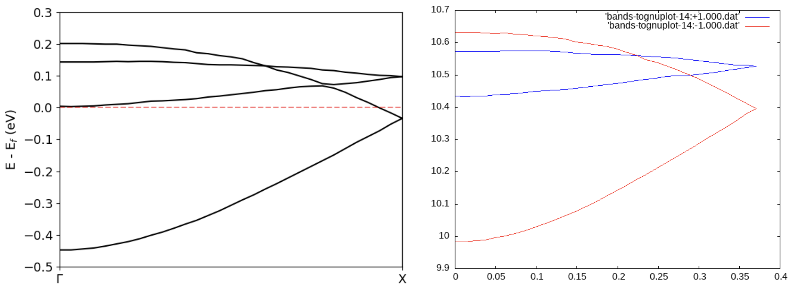
        <figcaption> Fig. 4: On the left, bands of CuBi<sub>2</sub>O<sub>4</sub>. On the right, bands separated based on eigenvalues of the glide reflection g<sub>x</sub>. Blue (red) lines correspond to the eigenvalue +1 (-1). </figcaption>
</figure>
</div>
<br/>

Now, we are sure that there isn't any tiny gap at the points where bands seem to cross, thus they do cross. Therefore, it isn't sensible to consider this material an insulator (at DFT's weakly-correlated level) to study the topology of valence bands.

## Example: Bi<sub>2</sub>Se<sub>3</sub> 

In this section, we propose repeating for Bi<sub>2</sub>Se<sub>3</sub> the analysis we did for SnTe. Again, you can find in the directory `Bi2Se3/DFT` the input files for Quantum Espresso. If you don't have the means to run them, don't worry, the output files are also there. In particular, the files with the wave functions that `IrRep` will take as input are located in `Bi2Se3/DFT/out`.

<div align="center">
<figure>
	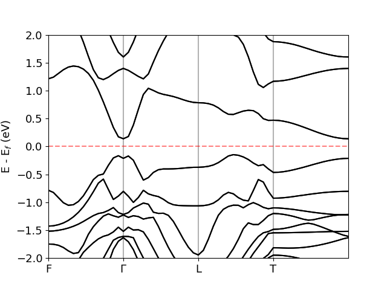
        <figcaption> <br> Fig.5: Bands of Bi2Se3 calculated with Quantum Espresso. </figcaption>
</figure>
</div>
<br/>

### Irreps at maximal k-points

Go to the directory `Bi2Se3/IrRep/irreps_maximal-K` and run the command written in `run_irrep.sh`:

```
irrep -code=espresso -prefix=../../DFT/out/bi2se3 -Ecut=50 -kpoints=1,16,31,46 -kpnames=F,GM,L,T -IBend=78 -EF=auto > IrRep.out
```

Alternatively, you could have run `bash run_irrep.sh`, which basically executes the command above. This way, `IrRep` has computed the irreps of valence bands and written them to the file `IrRep.out`. Now, we can place them on top of a band structure plot.

<div align="center">
<figure>
	
        <figcaption> Fig. 6: Bands of Bi<sub>2</sub>Se<sub>3</sub> and irreps of valence bands calculated with IrRep </figcaption>
</figure>
</div>
<br/>

In order to determine if the valence bands are topological, we can pass the `trace.txt` file generated by `IrRep` to the software <a href="https://www.cryst.ehu.es/cgi-bin/cryst/programs/magnetictopo.pl?tipog=gesp"> Check Topological Mat </a>. The result is shown in the following picture:

<div align="center">
<figure>
	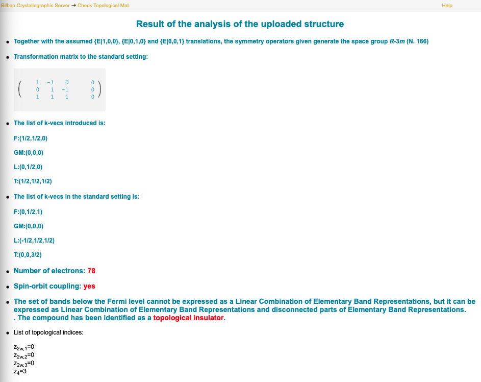
        <figcaption> Fig. 7: Output of ChecktopologicalMat with the file trace.txt generated by IrRep </figcaption>
</figure>
</div>
<br/>

In conclusion, the valence bands of Bi<sub>2</sub>Se<sub>3</sub> are topological and this topology is diagnosed by the following symmetry indicators:

<div align="center">

(*z*<sub>2w,1</sub>, *z*<sub>2w,2</sub>, *z*<sub>2w,3</sub>, *z*<sub>4</sub>) = (0, 0, 0, 3).

</div>

### Separating inversion subspaces

Let's check the calculation of the *z*<sub>4</sub> index by separating inversion even and odd subspaces. For that, we run again the calculation of irreps, but setting the parameter `isymsep` to the index of inversion:

```
irrep -isymsep=7 -code=espresso -prefix=../../DFT/out/bi2se3 -Ecut=300 -kpoints=1,16,31,46 -kpnames=F,GM,L,T -IBend=78 -EF=auto > IrRep.out
```

We read in the output stored in `IrRep.out` the number of inversion-even and odd Kramers pairs at each TRIM:

<div align="center">

   |                 | &Gamma; |  F  |  X  |  L  |
   | :-------------: | ------- | --- | --- | --- | 
   | *N*<sub>+</sub> |    22   |  21 |  21 |  21 | 
   | *N*<sub>-</sub> |    17   |  18 |  18 |  18 | 

</div>

Having in mind that there are 3 non-equivalent points F and X in the BZ, we can apply the formula to calculate the *z*<sub>4</sub> indicator:

<div align="right">

 *z*<sub>4</sub> = ((17 + 3 x 18 + 3 x 18 + 18) - (22 + 3 x 21 + 3 x 21 + 21)) / 2 mod 4 = 3

</div>

## Summary

In this chapter, we have shown how to use `IrRep` to

- Calculate the irreps and symmetry eigenvalues of DFT bands at maximal k-points. 
- Separate bands based on the eigenvalues of a symmetry operation.

We have demonstrated that `IrRep` and the software <a href="https://www.cryst.ehu.es/cgi-bin/cryst/programs/magnetictopo.pl?tipog=gesp"> Check Topological Mat. </a> form a powerful toolbox to study numerically the topology of DFT bands. Furthermore, its capacity to separate bands in terms of eigenvalues of symmetry operations makes `IrRep` suitable to analyze band crossings.

### You are welcome to give us your feedback :clipboard:, report bugs :bug: and contribute :octocat:!

<a href="https://github.com/stepan-tsirkin/irrep"> `IrRep`'s official Github repository </a> 

---

# Z2Pack tutorial: Topological invariants through Wilson loops

<div align="center">
<figure>
	
</figure>
</div>

In this chapter we will work out some useful examples to compute Wilson loops (and topological invariants) using Z2Pack python package (<a href="https://z2pack.greschd.ch/en/latest/">Z2Pack</a>). You can find extensive theoretical formulation in <a href="https://z2pack.greschd.ch/en/latest/_downloads/75eec5bb13ab1589c8b65a3cc3781afd/z2pack_chapter.pdf">Z2Pack notes</a>.

## Berry phase and Wilson loop

Following the theory lecture, we know that the non-abelian Berry phase of an isolated set of bands can be computed as:

<div align="center">

&gamma;=i&int;<sub>C</sub>&sum;<sub>n</sub>< n,**k**| &nabla;<sub>**k**</sub>|n,**k**>,

</div>

where we sum over the occupied set of bands. We also know how to compute the Chern number by tracking the evolution of Berry phases along momentum space. In particular, in a 2D BZ parametrized by (k<sub>x</sub>, k<sub>y</sub>) we can compute the Berry phase &gamma; as a function of k<sub>x</sub>:


<figure>
	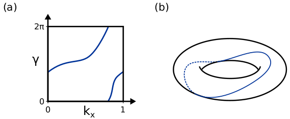
</figure>

In (a), we can see the calculation of the Berry phase as a function of k<sub>x</sub>. Since the Berry phase is 2&pi; periodic, same as momentum, we can plot it in a more visual way as shown in (b). The winding number of this line is exactly the **Chern number**. Then, the calculation of the Chern number reduces to tracking the evolution of Berry phases across the BZ. This is the so-called Wilson loop. It can be understood as a matrix *W* that parallel transports states from a point **k**<sub>0</sub> to the same point after a full loop. The Wilson loop *W* can be approximated as:

<div align="center">

*W*=*M* <sup>**k**<sub>0</sub></sup><sup>**k**<sub>1</sub></sup> *M* <sup>**k**<sub>1</sub></sup><sup>**k**<sub>2</sub></sup> ... *M* <sup>**k**<sub>n-1</sub></sup><sup>**k**<sub>0</sub></sup>,

</div>
where

<div align="center">

*M* <sup>**k**<sub>0</sub></sup><sup>**k**<sub>1</sub></sup><sub>mn</sub> = < m,**k**<sub>0</sub>|n,**k**<sub>1</sub>>.

</div>

The eigenvalues &lambda;<sub>i</sub> of the Wilson loop matrix *W* are connected to the total Berry phase:

<div align="center">

&gamma;<sub>Tot</sub>=&sum;<sub>i</sub> &lambda;<sub>i</sub>

</div>

## The Z2Pack code

Z2pack can be easily installed by typing the following in a terminal:

```
python -m pip install --user z2pack
```

Here we can see an overview of the process:

<figure>
	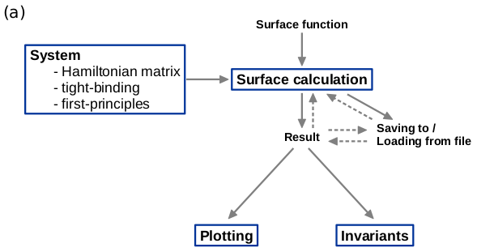
</figure>

There are two main ingredients:

- **Electronic Hamiltonian**. There are 3 input ways:
    - Explicit Hamiltonian matrix. Useful for theoretical models, **k**.**p**.
    - Tight binding model. This is provided through the <a href="https://tbmodels.greschd.ch/en/latest/">TBmodels</a> package. See example *Haldane model*.
    - Ab initio calculation. In this case, the *M* <sup>**k**<sub>i</sub></sup><sup>**k**<sub>j</sub></sup> matrices are extracted from an ab initio calculation directly, using the interface with <a href="http://www.wannier.org/">Wannier90</a>. See examples *Bi*<sub>2</sub>*Se*<sub>3</sub>* strong TI* and *SnTe mirror Chern insulator*.

- **Surface**. There are many ways to define the 2D surface on which the Chern number is computed. We show here two examples:

```
# Defining an explicit function
def surface(s,t):
    return[s,t,0]

# Equivalent expression using a lambda
surface = lambda s,t:[s,t,0]
```

Finally, there are parameters that control convergence:

- **pos\_tol**. The maximum movement of a WCC for the iteration w.r.t. the number of k-points in a single string to converge. The iteration can be turned off by setting pos\_tol=None.

- **gap\_tol**. Determines the smallest distance between a gap and its neighbouring WCC for the gap check to be satisfied. The distance must be larger than gap\_tol times the size of the gap. This check is performed only for the largest gap in each string of WCC. The check can be turned off by setting gap\_tol=None.

- **move\_tol**. Determines the largest possible movement between WCC of neighbouring strings for the move check to be satisfied. The movement can be no larger than move\_tol time the size of the largest gap between two WCC (from the two neighbouring strings, the smaller value is chosen). The check can be turned off by setting move\_tol=None.

- **num\_lines**. Initial number of strings.

- **min\_neighbour_dist**. Minimum distance between two strings (no new strings will be added, even if the gap check or move check fails).

## Examples

All examples are prepared so they can be easily run. Just go to the example folder and run:

```
python run_{NAME}.py
```


### SnTe mirror Chern insulator

<figure>
	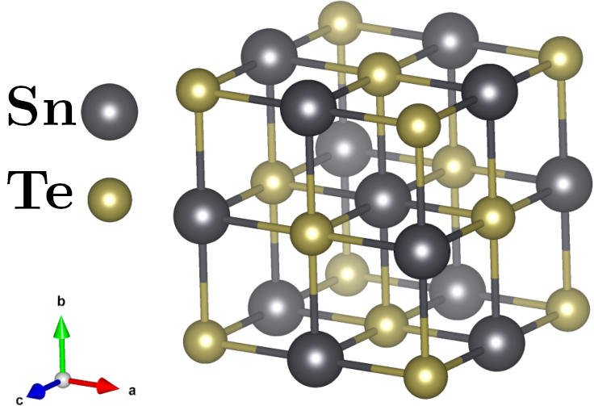
</figure>

Strong topological insulators are protected by time reversal symmetry. Crystal symmetries can play a similar role in protecting topology too. We will now carry out an example of mirror-symmetry protected topological phase in SnTe. In this case, we will compute the Wilson loop from an *ab initio* calculation.

:memo: **Note:** For this example we need a special version of QE compiled with an extra package. For info on how to compile on your own systems please check <a href="https://github.com/Z2PackDev/Z2Pack/tree/master/2.2.x/examples/fp/espresso/pw2z2pack/mirror_snte">this webpage</a>

We need to move to `Z2pack_tutorial/Mirror_SnTe`. Following the `IrRep` tutorial, we know that SnTe can be in one of two topological phases as indicated by symmetry:
- Mirror Chern insulator with mirror m<sub>110</sub> Chern number 2
- Mirror Chern insulator with mirror m<sub>001</sub> Chern number 4

To elucidate in which phase it is, we will run Wilson loop calculations on the different mirror planes. Let's start with the plane (110). First, we need to specify the symmetry in Quantum Espresso. This is done in a similar way to irrep. Open the file `input/snte.pw2z2+i.in`:


```
&inputpp
  prefix='SnTe'
  outdir='../scf'
  seedname='snte'
  isym=29
  sym_eig=(0.0d0,1.0d0)
  nexband=12
/
```

The flag `isym` represents the symmetry operation we choose to split the eigenstates, as listed by Quantum Espresso. We can check this in the `scf/scf.out` file. Let's open it and find the m<sub>110</sub> symmetry operation.

<figure>
	
</figure>

We can see that the mirror m<sub>110</sub> is `isym=29`. We have to provide the numerical eigenvalue of the symmetry operation too. In this case, a mirror has eigenvalues &pm;i, thus `sym_eig=(0.0d0,1.0d0)`. The flag `nexband` allows us to remove unnecessary core/conduction bands.


Let's open `run_m1.py`. Open the script. The first four blocks do the following:

- **Paths stuff:** Define the location of Quantum Espresso and Wannier90 executables. Already set for your VMs.
- **SCF calculation:** Run the self-consistent calculation. Already run for you.
- **Defining systems:** Build one system per symmetry eigenvalue. Already set.
- **Defining Settings:** Wilson loop calculation settings. Already set.

:memo: **Do not touch these blocks unless you know what you are doing.**


Let's take a look at the next blocks. We have to define the plane in reciprocal space to compute the Wilson loop. We have to choose the plane that coincides with the mirror m<sub>110</sub>.

<div align="center">
<figure>
	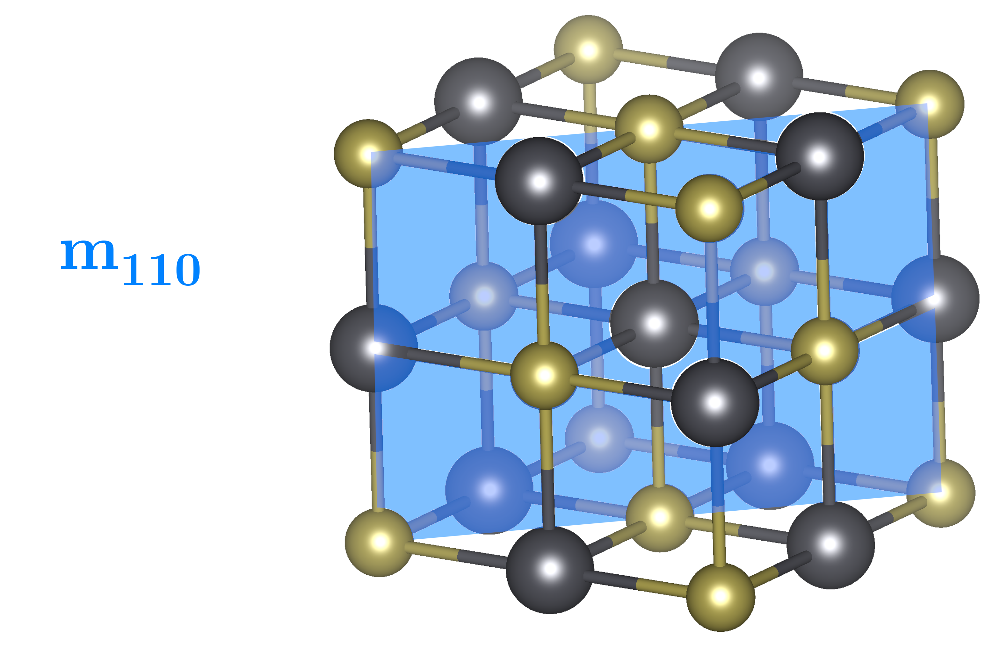
</figure>

<figure>
	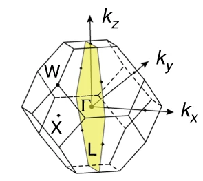
</figure>
</div>


In our case:

```
surface = lambda s, t: [s, s, t]
```

:memo: It has to be written in reduced coordinates, be careful with non-orthogonal bases (like this one)


We can finally run the calculation. Open a terminal an type:

```
python run_m1.py
```

This will print the mirror Chern number in each eigenvalue subspace and produce the following plot:


<div align="center">
<figure>
	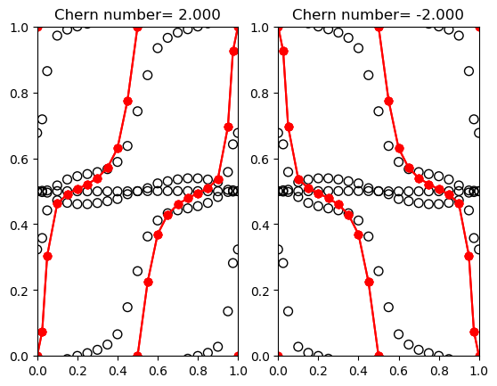
</figure>
</div>


```
Chern number for +i eigenstates: 2.0000000458171185
Chern number for -i eigenstates: -1.9999993526185875
```

You may notice that the program run extremely fast. This is because we left the calculation results in the folder `results` and we are loading them in the system build part:

```
res_plus = z2pack.surface.run(
    system=snte_plus,
    surface=surface,
    save_file='results/res_plus_m1.json',
    load=True,
    **settings
)
```

You can now try to run the full calculation without loading or saving it to another file.


#### Going further

- Check the Wilson loop on k<sub>z</sub>=0 regarding the mirror m<sub>001</sub>. For this, we need to modify `run_m1.py` and `snte.pw2z2+i.in`. If you get stuck, there's help files. Main points to change:
    - `isym` value for m<sub>001</sub>.
    - Surface for the calculation.

<figure>
	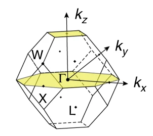
</figure>
</div>

:memo: **Remember:** You have to change the names of the saved results so you can load the results we left for you. Otherwise it takes some time to run the calculation.

:memo: **Help:** We left the main blocks to change in `Help` folder.


### Haldane model

<div align="center">
<figure>
	
</figure>
</div>


In this example we will compute the Chern number on the Haldane model both in the trivial and topological regimes. In the next figure we can see the known phase diagram of the model:

<div align="center">
<figure>
	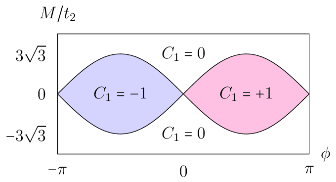
</figure>
</div>

We can implement the tight binding model by means of TBmodels as follows. First, we define a function that will produce the Haldane model for the parameter inputs:

```
import z2pack
import numpy as np
import matplotlib.pyplot as plt
import tbmodels as tbmodels

def Haldane(M_rel,phase):
    # set model parameters
    t=-1.0
    M=M_rel*0.15
    t2 =0.15*np.exp((1.j)*phase)
    t2c=t2.conjugate()

    # define lattice vectors
    lat=[[1.0,0.0],[0.5,np.sqrt(3.0)/2.0]]
    # define coordinates of orbitals
    orb=[[1./3.,1./3.],[2./3.,2./3.]]

    model = tbmodels.Model(
        on_site=(-M,M),
        pos=orb,
        occ=1,
        uc=lat)
    # nearest neighbor hopping, sets the energy scale
    model.add_hop(t, 0, 1, [ 0, 0])
    model.add_hop(t, 1, 0, [ 1, 0])
    model.add_hop(t, 1, 0, [ 0, 1])
    # add second neighbour complex hoppings
    model.add_hop(t2 , 0, 0, [ 1, 0])
    model.add_hop(t2 , 1, 1, [ 1,-1])
    model.add_hop(t2 , 1, 1, [ 0, 1])
    model.add_hop(t2c, 1, 1, [ 1, 0])
    model.add_hop(t2c, 0, 0, [ 1,-1])
    model.add_hop(t2c, 0, 0, [ 0, 1])
    
    return model
```

We generate the model with a few lines:

```
M=0.0
phase=np.pi/2
Haldane_model = Haldane(M,phase)
tb_system = z2pack.tb.System(Haldane_model)
```

and the parameters for the Wilson loop calculation (more info on the parameters can be found on <a href="https://z2pack.greschd.ch/en/latest/">Z2Pack</a>):

```
settings = {
    'num_lines': 31,
    'pos_tol': 1e-2,
    'gap_tol': 0.2,
    'move_tol': 0.3,
    'iterator': range(10, 35, 12),
    'min_neighbour_dist': 2e-2
}
```

Finally, we run the Wilson calculation, plot the results and compute the topological invariant:

```
res = z2pack.surface.run(system=tb_system, surface=lambda s, t: [s, t], **settings)
z2pack.plot.wcc(res, gaps=False)
plt.savefig('Haldane_WCC.pdf', bbox_inches='tight')
print("The total Chern number is: ",z2pack.invariant.chern(res)) 
```
which outputs the following plot and result:

```
The total Chern number is:  1.0
```


<div align="center">
<figure>
	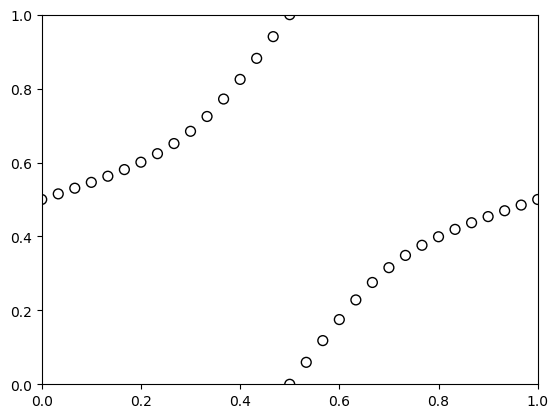
</figure>
</div>


#### Going further
You can now play with the parameters to check that the phase diagram is correct.
- Select a few points of the phase diagram and run the Wilson loop calculation. What happens near a boundary? Why?
- (Advanced) Modify the code to compute the Chern number on a parameter grid. Reproduce the phase diagram.


### Bi<sub>2</sub>Se<sub>3</sub> strong topological insulator

In this case we will compute the topological indices of a well known 3D topological insulator, Bi<sub>2</sub>Se<sub>3</sub>. To determine the 4 topological indices of a 3D TI we have to compute the 2D Z<sub>2</sub> index on 6 planes, namely k<sub>i</sub>=0,&pi; with i=x,y,z. As we did in the previous example, first we define the system. In this example, we will run the ab initio calculation in the latest version of <a href="https://www.quantum-espresso.org/">Quantum Espresso</a>. The system is then defined by the input files in ```inputs```:

- bi2se3.nscf.in: Quantum Espresso non-self consistent calculation input. Contains info about the structure and how to run the calculation.
- bi2se3.pw2wan.in: Input file for interfacing with Wannier90. Computes the *M* <sup>**k**<sub>i</sub></sup><sup>**k**<sub>j</sub></sup> matrices.
- bi2se3.win. Wannier90 input file. Defines the number of bands to consider/exclude.

Then, the Wilson loop calculation follows the same procedure as before. We define the calculation settings:

```
settings = {
    'num_lines': 11,
    'pos_tol': 1e-1,
    'gap_tol': 0.3,
    'move_tol': 0.4,
    'iterator': range(10, 70, 6),
    'min_neighbour_dist': 2e-2
}
```
:memo: **Note:** In this case you should not change the settings for the first run. Changing the settings would result in extra calculations.

For the Z<sub>2</sub> calculations we don't need to compute the Wilson loop on the whole Brillouin zone, just on half. Then, the surface parameter for the k<sub>x</sub>=0 plane will be:

```
surface=lambda s, t: [0, s / 2, t]
```
You can permute the coordinates of the surcface to obtain the remaining ones. We then run the calculation on the k<sub>x</sub>=0 plane as follows:

```
result_kx_0 = z2pack.surface.run(
    system=system,
    surface=lambda s, t: [0, s / 2, t],
    save_file='./results/res_kx_0.json',
    load=True,
    **settings
)
```

Finally, we get the Wilson loop plot:

<div align="center">
<figure>
	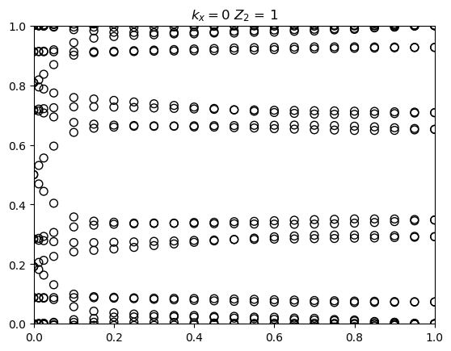
</figure>
</div>

From here we extract the topological indices:

<div align="center">

Z<sub>2</sub>=1
Z<sub>w1</sub>=0
Z<sub>w2</sub>=0
Z<sub>w3</sub>=0

</div>

#### Going further
- The Wilson loop calculation prints out an error, what is its meaning? Can you solve it?
- Without changing the calculation settings, run the Wilson loop for the other k<sub>i</sub>=0 planes. What are the topological indices of Bi<sub>2</sub>Se<sub>3</sub>?

:memo: **Note:** There are 4 topological indices in 3D for TRS-protected phases:
- Weak &Z;<sub>2i</sub> indices (i=x,y,z). This is equal to the &Z;<sub>2</sub> indicez of k<sub>i</sub>=&pi;
- Strong &Z;<sub>2</sub> index. This is equal to the sum of &Z;<sub>2</sub> indices on the six k<sub>i</sub>=0,&pi; planes mod 2.

:memo: **Help:** The Wilson loop plots for the 6 planes should look like this:

<div align="center">
<figure>
	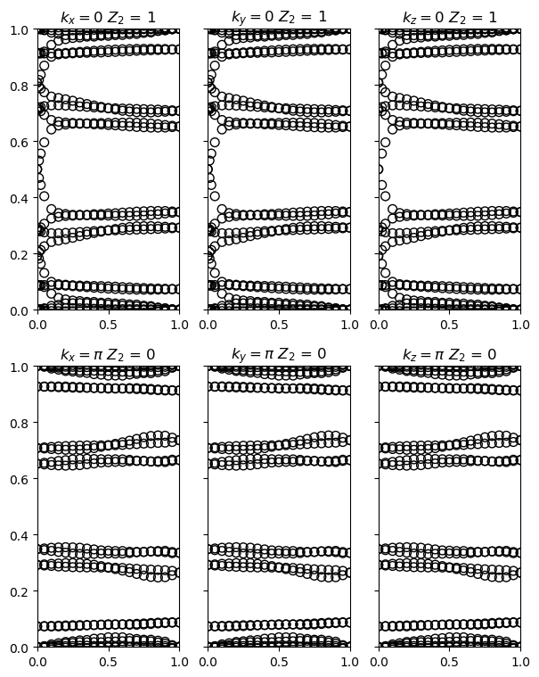
</figure>
</div>
